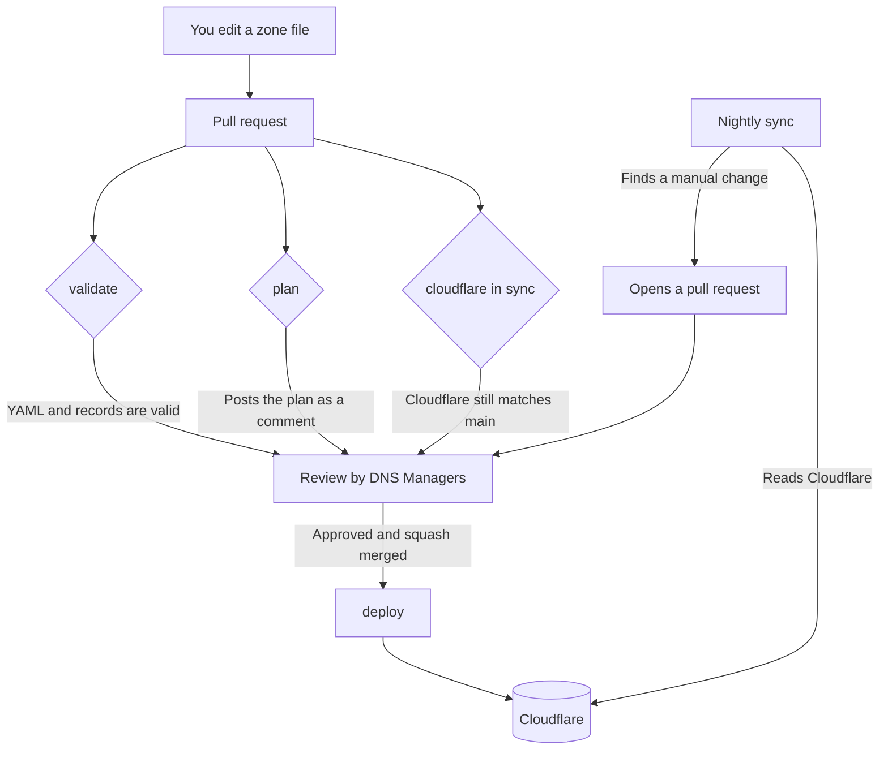

# Wentworth Coding Club DNS

[](https://github.com/WITCodingClub/dns/actions/workflows/validate.yml)
[](https://github.com/WITCodingClub/dns/actions/workflows/deploy.yml)
[](https://github.com/WITCodingClub/dns/actions/workflows/sync-from-cloudflare.yml)

This repository holds the DNS records for the Wentworth Coding Club. The YAML
files are the source of truth. [octoDNS](https://github.com/octodns/octodns)
applies them to Cloudflare when a pull request merges to `main`.

You get a subdomain by opening a pull request. You do not need Cloudflare
access.

## Managed domains

| Domain | Zone file | Used for |
|---|---|---|
| `witcc.dev` | [`witcc.dev.yaml`](./witcc.dev.yaml) | The club and its projects |
| `hackwit.org` | [`hackwit.org.yaml`](./hackwit.org.yaml) | The HackWIT hackathon |

## Get a subdomain

### 1. Fork and edit

[Fork this repository](https://github.com/WITCodingClub/dns/fork), then open the
zone file for the domain you want. Add your record in alphabetical order:

```yaml
docs: # mayonej@wit.edu
  - ttl: 600
    type: CNAME
    value: docs-site.netlify.app.
```

That creates `docs.witcc.dev` and points it at `docs-site.netlify.app`.

Three rules decide whether it works:

- **The name is the part before the domain.** `docs` becomes `docs.witcc.dev`.
- **A `CNAME` value ends with a dot.** An `A` or `AAAA` value does not.
- **Every record needs an owner.** Put a WIT email in a comment on the same
  line as the name. We use it to find out who to ask when the record breaks.
  List more than one person if more than one person is responsible.

### Order is checked

The `dns records` check fails on a zone file that is out of order, so this is
a rule and not a request. The order is **natural**, not plain alphabetical:

- Records go in order by name, and `ns2` comes before `ns10`.
- The apex record, written `""`, comes first.
- Inside a record, `octodns` comes before `ttl`, `type` and `value`.

Run `./bin/validate` to check before you push. The nightly sync writes files
in this order by itself.

### 2. Open a pull request

A bot adds two things to your pull request:

- **A plan.** It lists every record the merge would create, change, or delete.
  Read it. If it shows something you did not intend, fix your branch.
- **A reviewer.** The rotation in
  [`.github/dns-reviewers.txt`](./.github/dns-reviewers.txt) decides whose turn
  it is.

Push more commits to the same branch if the reviewer asks for changes. Do not
close the pull request and open a new one.

### 3. Wait for the deploy

Cloudflare gets the change within about a minute of the merge. Most resolvers
follow within the TTL. A few take up to 24 hours.

## Record types

| Type | Points at | Example value |
|---|---|---|
| `A` | An IPv4 address | `192.0.2.1` |
| `AAAA` | An IPv6 address | `2001:db8::1` |
| `CNAME` | Another domain | `example.com.` |
| `TXT` | Text, for verification or SPF | `"a-verification-string"` |
| `MX` | A mail server | See the zone file for the current setup |

### More than one record on one name

```yaml
docs: # mayonej@wit.edu, lambertl@wit.edu
  - ttl: 600
    type: CNAME
    value: docs-site.netlify.app.
  - ttl: 600
    type: TXT
    value: "a-verification-string"
```

### Behind the Cloudflare proxy

Add the `octodns` block to put a record behind Cloudflare:

```yaml
app: # mayonej@wit.edu
  - octodns:
      cloudflare:
        proxied: true
    ttl: 300
    type: A
    value: 192.0.2.1
```

`octodns` comes before `ttl`. See **Order is checked** below.

## How it works



Four workflows do the work:

| Workflow | Runs when | Does what |
|---|---|---|
| [`validate`](./.github/workflows/validate.yml) | Every pull request | Checks the YAML, every record, and the tools tests. Holds no secrets, so it is safe on forks. |
| [`plan`](./.github/workflows/plan.yml) | Every pull request | Posts the plan as a comment, and fails if Cloudflare has drifted away from `main`. |
| [`deploy`](./.github/workflows/deploy.yml) | Push to `main` | Applies the zone files to Cloudflare, then confirms they match. Refuses a plan that deletes more than three records. |
| [`sync-from-cloudflare`](./.github/workflows/sync-from-cloudflare.yml) | Nightly | Pulls manual Cloudflare changes back into the zone files as a pull request. |

### Why the nightly sync exists

Cloudflare lets a club officer change a record in the dashboard. octoDNS does
not know about that change, so the next deploy would undo it.

The nightly job reads Cloudflare, folds anything new into the zone files, and
opens a pull request. The change keeps its history and gets an owner. The
`cloudflare in sync` check blocks other merges until that pull request lands,
so nobody can overwrite the change by accident.

See [`docs/runbook.md`](./docs/runbook.md) for what to do when a check fails.

### The `octodns-meta` record

Every zone has a `octodns-meta` TXT record. octoDNS writes it on each deploy.
Use it to confirm that a deploy reached Cloudflare:

```console
$ dig +short TXT octodns-meta.witcc.dev
"octodns-version=1.14.0" "provider=cloudflare" "time=2026-09-21T07:17:03+00:00"
```

It only changes when something else in the zone changes, so it does not create
a deploy of its own every night. Do not add it to a zone file. The nightly sync
leaves it out on purpose.

## Work on this locally

You do not need a Cloudflare token to check your own change.

```console
$ python3 -m venv env
$ ./env/bin/pip install -r requirements.txt
$ export PATH="$PWD/env/bin:$PATH"

$ ./bin/validate     # parse the config and check every record
$ ./bin/zones        # list the zones this repository manages
```

These need a Cloudflare token in `CLOUDFLARE_TOKEN`. Ask a DNS Manager for a
read-only one.

```console
$ ./bin/plan         # show what a deploy would change
$ ./bin/dump .live   # write the live Cloudflare state to .live/
```

`./bin/sync` applies to production. Only the `deploy` workflow should run it.

Run the tests for the sync tooling:

```console
$ ./env/bin/python -m unittest discover -s tools -p 'test_*.py' -v
```

## Who can approve and merge

The [DNS Managers](https://github.com/orgs/WITCodingClub/teams/dns-managers)
team owns every file in this repository. A pull request needs an approving
review from that team before it can merge.

[`CONTRIBUTING.md`](./CONTRIBUTING.md) covers the review rules.
[`docs/runbook.md`](./docs/runbook.md) covers the jobs a DNS Manager has to do.

## Who can have a subdomain

Subdomains are for club projects, club events, and club services. Ask an
E-Board member on Discord if you are not sure whether yours counts.

## Get help

- Open an [issue](https://github.com/WITCodingClub/dns/issues/new/choose).
- Ask in the club Discord.
- Read the [octoDNS documentation](https://octodns.readthedocs.io/en/stable/).
